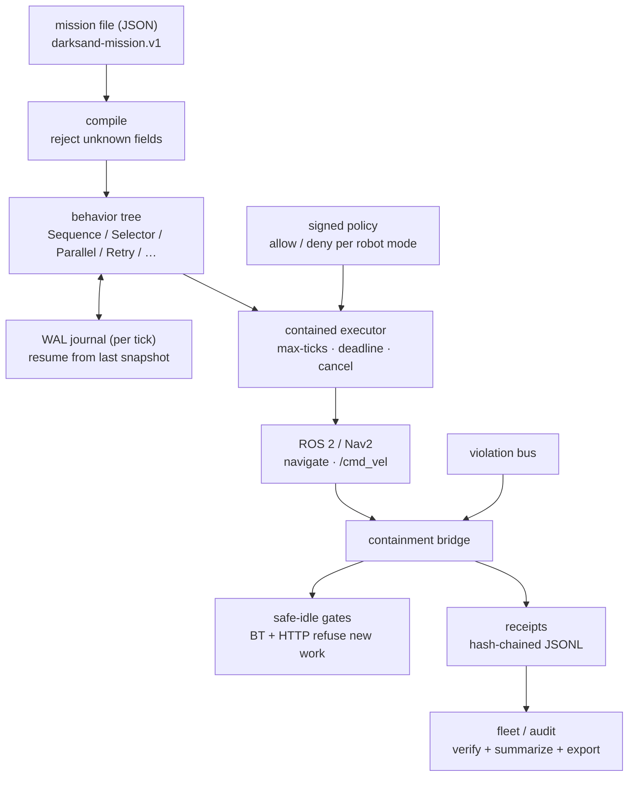
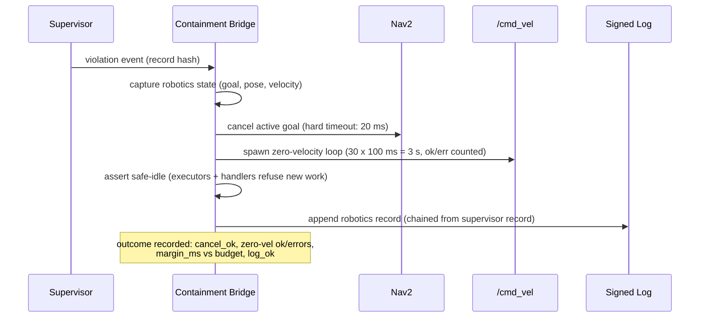
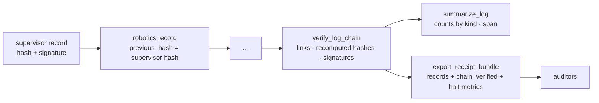

# Darksand — governed execution for physical systems


**Action → Run → Proof for robots.** Deterministic behavior-tree missions run
under a safety containment halt, governed by signed policy, with every run
leaving tamper-evident receipts.

Darksand sits *under* any policy model (VLA, diffusion, heuristic) and sells
compliance, not intelligence: missions are declared, execution is bounded, and
the audit trail is signed.

> Rebranded to Darksand; originally extracted from upstream runtime +
> control-plane repos at commit `7e6098ef9` (2026-10-04) under owner
> authorization. Both repos are MIT licensed; original copyright headers are
> preserved in extracted files.

## How it works



### Halt sequence (critical-path budget: 50 ms)



Every halt produces a `HaltOutcome` and feeds a bounded latency histogram
(`p50`/`p99`/`max` + over-budget count). Margins answer "how close did we come
to missing the deadline" without extra instrumentation.

### Run receipts



## Layout

| Crate | What it does |
|---|---|
| `darksand-btree` | Deterministic mission core: control flow, decorators, blackboard conditions, ROS action nodes (`ros2` = stub, `ros2-live` = real `r2r`). JSON mission loader (`darksand-mission.v1` + goal/disposition/cost header), per-tick WAL journal + resume, max-ticks/deadline/cancel, tick observer. Deferred: LLM planners, tool registry, visualizer. |
| `darksand-safety` | Containment: `ContainmentGuard`/`Supervisor` (worker process, cgroup on Linux, timeout + SIGKILL), `ViolationEventBus`, signed hash-chained records, `verify_log_chain`, `summarize_log`. Non-Linux is a dev-only stub. |
| `darksand-ros2` | ROS 2 node (`r2r`, feature-gated), Nav2 (`navigate_to_pose`), `/cmd_vel` safety publisher, containment bridge (20 ms cancel + 3 s zero-velocity + safe-idle + `HaltOutcome`/`HaltMetrics` + receipt export). |
| `darksand-recovery` | Nav2 recoveries (spin, backup, clear-costmap) + generic retry classification. No-ops without the `ros2` feature. |
| `darksand-policy` | Standalone policy service (SQLite): versioned robot-mode policies (`supervised\|active\|disabled`), allow-lists, Ed25519-signed lifecycle commands with nonce replay protection, audit trail. |
| `darksand-fleet` | Fleet agent: register / config-sync / signed telemetry. Real system stats; mock values only in explicit `mock_mode`. `.darksand/` key material is never committed. |
| `darksand-swarm` | Coordination primitives. Transport is in-process only (no multi-host yet); message signing unintegrated. |
| `darksand-sensors` | GPIO/camera/lidar interfaces. Hardware backends are simulated (test-pattern frames, sine-wave scans); actuators default to safety-blocked. |
| `darksand-simulation` | Sim envs (`virtual_swarm` real; `gazebo`/`isaac_sim` config names only) + versioned `SimManifest` (properties hashed for run comparability). |
| `missions/` | Example mission files (`wharf-inspection.json`). |
| `config/robotics.example.json5` | All sections disabled by default. |
| `reference/` | Rebranded upstream sources not yet promoted. |
| `docker/Dockerfile.ros2` | ROS Humble build + stub-test gate. |

## Quickstart

```sh
# stub ROS 2, no hardware needed
cargo check --workspace && cargo test --workspace

# ROS node paths against the stub
cargo test -p darksand-btree --features ros2

# real r2r bindings (needs ROS Humble on the host or Docker)
docker build -f docker/Dockerfile.ros2 .

# policy service
DARKSAND_POLICY_KEYS="tenant:key" cargo run -p darksand-policy
```

Run a mission file through the contained executor:

```rust
let mut tree = darksand_btree::mission_from_file("missions/wharf-inspection.json")?;
let mut ctx = darksand_btree::core::BTreeContext::new();
let result = darksand_btree::BTreeExecutor::new()
    .with_wal("run.jsonl")              // crash recovery journal
    .execute_with_cancel(&mut *tree, &mut ctx, idle_rx)  // safe-idle gate
    .await?;
// after a crash: darksand_btree::resume_mission_from_wal(mission_json, "run.jsonl").await?
```

Verify an audit log:

```rust
darksand_safety::verify_log_chain("violations.jsonl", &verifying_key)?;
let summary = darksand_safety::summarize_log("violations.jsonl")?;
```

## Honest stubs

No hardware is claimed. Today: swarm transport is in-process, sensors are
simulated, `gazebo`/`isaac_sim` are config names, fleet dashboard has no
store, recovery/fleet paths are local-only or mock-gated, and containment is
only enforced on Linux. See each crate's docs for the exact boundary.

## Roadmap

* **Phase 0 — Repair (this branch):** fleet honesty fixes, standalone BT
  core, standalone policy service, ROS 2 Docker CI, `darksand-*` renames.
* **Phase 1 — Single-robot MVP:** JSON mission files → BT + Nav2 under
  containment, signed run receipts, Gazebo sim-in-loop. *(Mission loader,
  WAL resume, halt metrics, and receipt export are done; HIL numbers pending.)*
* **Phase 2 — Fleet control plane:** registration, config push, real
  telemetry dashboards, policy governance per robot mode.
* **Phase 3 — Swarm + HIL:** multi-host transport, Isaac Sim, self-hosted rig.

Not building: LLM planners as product surface, marketplace, workflow
builder, new protocols — frozen until Phase 1 ships.

## Safety invariants

Server-side authz (bearer tenants; all v1 key-holders are admin), tenant-scoped
state, deny-by-default targets, no blind replay of uncertain effects, signed
commands with 5-minute skew + nonce replay windows, no secrets in logs or git.
