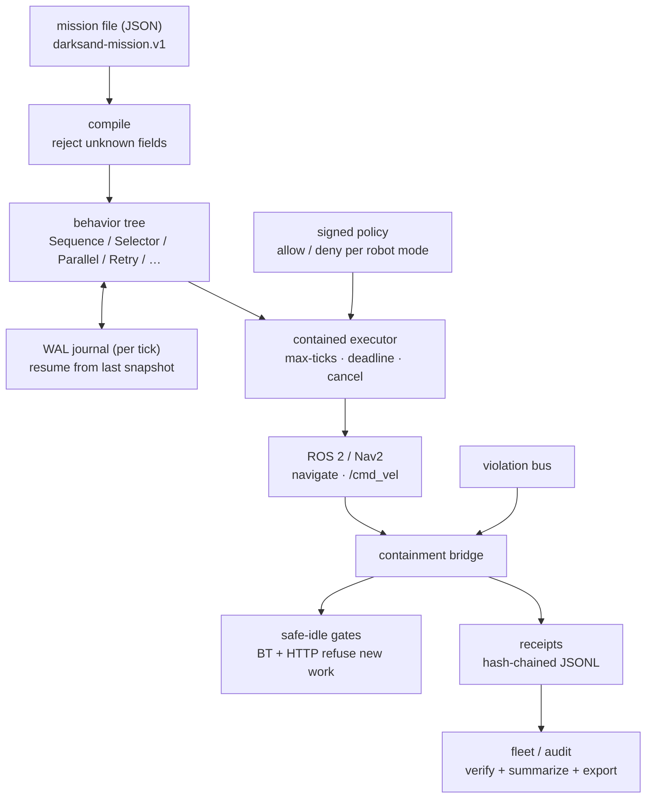
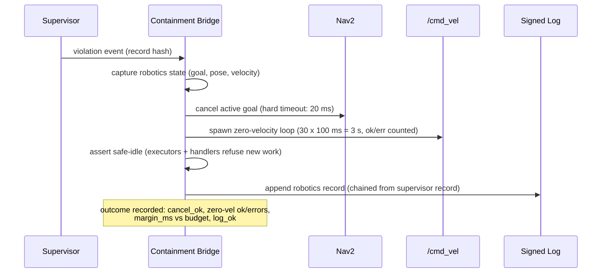
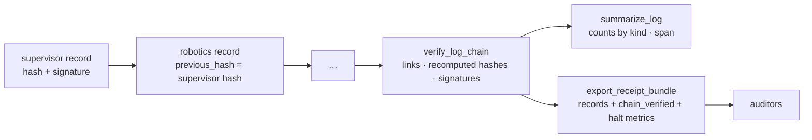

# Darksand: governed execution for physical systems


**Action → Run → Proof for robots.** Missions are declared as files, runs are
bounded by containment, and every run leaves signed receipts.

Darksand sits under any policy model (VLA, diffusion, heuristic). It does not
pick actions. It checks that actions are allowed, stops the robot when they
are not, and proves what happened.

> Rebranded to Darksand. Extracted from upstream runtime and control-plane
> repos at commit `7e6098ef9` (2026-10-04) under owner authorization. Both
> repos are MIT licensed. Original copyright headers are preserved in
> extracted files.

## How it works



### Halt sequence (critical-path budget: 50 ms)



Each halt records a `HaltOutcome` and a latency sample. The histogram tracks
`p50`/`p99`/`max` plus an over-budget count. Margins show how close a halt
came to missing its deadline.

### Run receipts



## Layout

| Crate | What it does |
|---|---|
| `darksand-btree` | Deterministic mission core: control flow, decorators (`Repeat`, `Retry`, `Timeout`, `Watchdog`), blackboard conditions, ROS action nodes (`ros2` = stub, `ros2-live` = real `r2r`). JSON mission loader with goal, disposition, and cost header. Per-tick WAL journal with identity checks and resume. Max-ticks, deadline, cancel, tick observer. Goal-gated `RunProof`: success without a satisfied goal is not proof. Static `lint()` and structural `cost_bound()`. Deferred: LLM planners, tool registry, visualizer. |
| `darksand-safety` | Containment: `ContainmentGuard`/`Supervisor` (worker process, cgroup on Linux, timeout and SIGKILL). Exact violation taxonomy (`Time`, `Cpu`, `Infra`, `Malformed`). Signed hash-chained records with fsync. Chain recovery across restarts. `verify_log_chain` and `summarize_log`. Non-Linux is a dev-only stub. |
| `darksand-ros2` | ROS 2 node (`r2r`, feature-gated), Nav2 (`navigate_to_pose`), `/cmd_vel` safety publisher, containment bridge (20 ms cancel, 3 s zero-velocity loop with per-halt isolated counts, safe-idle gate, `HaltOutcome` with sequence numbers and margins, `HaltMetrics` histogram, STL-style coverage metric, receipt export). Legacy cancel now cancels the live goal. |
| `darksand-recovery` | Nav2 recoveries (spin, backup, clear-costmap) plus retry classification with capped backoff. Callers must gate recovery on safe-idle. No-ops without the `ros2` feature. |
| `darksand-policy` | Standalone policy service (SQLite): versioned robot-mode policies (`supervised\|active\|disabled`), allow-lists, Ed25519-signed lifecycle commands with nonce replay protection and reaping, constant-time auth, enforced expiry reads, audit trail. Fleet control plane (`register`, `config`, `telemetry`, `deregister`, `agents`) with signature verification. |
| `darksand-fleet` | Fleet agent: register, config-sync, signed telemetry upload against the live policy service. Deterministic canonical signing (`BTreeMap`), key directory override, traversal-proof key paths. Mock values only in explicit `mock_mode`. Key material is never committed. |
| `darksand-config` | Typed loader for `config/robotics.example.json5`. Strict sections, unknown fields rejected, `agent_id` generation, API secret resolved from env. |
| `darksand-swarm` | Coordination primitives. In-process transport only. Signed ingress with replay guard and timestamp skew checks. Election re-arming, leader recovery, heartbeat broadcast, no self-eviction. |
| `darksand-sensors` | GPIO, camera, and lidar interfaces. Hardware backends are simulated and labeled `Synthetic`. Force and tactile schema without a fabricating reader. Two-phase actuator confirmation with honest backends. |
| `darksand-simulation` | Sim envs (`virtual_swarm` real; `gazebo`/`isaac_sim` config names only). Measured benchmarks pinned to a versioned `SimManifest` digest. Sim-to-real metrics (rank correlation, replay error) with comparability checks. |
| `missions/` | Example mission files (`wharf-inspection.json`, carries a goal header and proves in test). |
| `config/robotics.example.json5` | All sections disabled by default. Parses through `darksand-config`. |
| `policy/` | Unbuilt Go reference. See `policy/README.md`. The live plane is `darksand-policy`. |
| `reference/` | Rebranded upstream sources not yet promoted. |
| `docker/Dockerfile.ros2` | ROS Humble build. Root `.dockerignore` keeps build context lean. |

## Quickstart

```sh
# stub ROS 2, no hardware needed
cargo check --workspace && cargo test --workspace

# ROS node paths against the stub
cargo test -p darksand-btree --features ros2

# real r2r bindings (needs ROS Humble on the host or Docker)
docker build -f docker/Dockerfile.ros2 .

# policy service (also serves the fleet control plane)
DARKSAND_POLICY_KEYS="tenant:key" cargo run -p darksand-policy
```

Run a mission file through the contained executor:

```rust
let mission = darksand_btree::Mission::from_file("missions/wharf-inspection.json")?;
assert!(mission.lint().is_empty());
let proof = mission.run(Default::default()).await?;
assert!(proof.is_proof()); // success AND goal satisfied
```

Verify an audit log:

```rust
darksand_safety::verify_log_chain("violations.jsonl", &verifying_key)?;
let summary = darksand_safety::summarize_log("violations.jsonl")?;
```

## Status

Implemented and tested in this branch:

* Mission files (`darksand-mission.v1`): loader, validation, lint, cost bounds, goal-gated proofs, WAL journal with resume.
* Containment halts: exact violation taxonomy, isolated per-halt counts, audit records on every path including lag recovery, latency histograms, receipt export.
* Fleet loop closed: agent and policy service tested together over real HTTP (register, config sync, telemetry, deregister, wrong-key and unknown-agent rejection).
* Config, sim manifests, transfer metrics, swarm verified ingress, actuator confirmation.

Test counts (all passing): btree 54 (62 with `ros2`), safety 29, ros2 39, swarm 32, sim 27, fleet 16, policy 6, sensors 10, config 4, recovery 3.

Not yet done (needs hardware or formal methods): independent safety channel, odometry subscribers, live Prometheus scrape, rppal and V4L2 backends, multi-host swarm transport, model-checked monitors.

## Honest stubs

No hardware is claimed. Swarm transport is in-process (inbound `receive()` is unimplemented, so swarm signature checks run at the coordinator ingress, not on real traffic). Sensors are simulated with no force or tactile backend. `gazebo` and `isaac_sim` are config names. Recovery and fleet paths are local-only or mock-gated outside the tested loop. Containment is only enforced on Linux. The Go `policy/` tree is an unbuilt reference (see `policy/README.md`); the live policy plane is `darksand-policy`. Each crate's docs state the exact boundary.

## Roadmap

* **Phase 0: Repair (this branch).** fleet honesty fixes, standalone BT core, standalone policy service, ROS 2 Docker CI, `darksand-*` renames.
* **Phase 1: Single-robot MVP.** JSON mission files to BT plus Nav2 under containment, signed run receipts, Gazebo sim-in-loop. (Mission loader, WAL resume, halt metrics, and receipt export are done. HIL numbers are pending.)
* **Phase 2: Fleet control plane.** registration, config push, real telemetry dashboards, policy governance per robot mode. (Register, config, telemetry, and deregister against the live service are done. Dashboards are pending.)
* **Phase 3: Swarm plus HIL.** multi-host transport, Isaac Sim, self-hosted rig.

Not building: LLM planners as product surface, marketplace, workflow builder, new protocols. Frozen until Phase 1 ships.

## Safety invariants

Server-side authz (bearer tenants; all v1 key-holders are admin), tenant-scoped state, deny-by-default targets, no blind replay of uncertain effects, signed commands with 5-minute skew plus nonce replay windows, no secrets in logs or git. Test keys that were once committed have been purged; rotate anything that trusted them.
